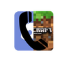

# Discord-MCPE

#####

Connect your PocketMine server with Discord&trade;!

## Installing:
1. Download phar from [Poggit&trade;](https://poggit.pmmp.io/ci/NiekertDev/Discord-MCPE)
2. Put it in /plugins folder
3. Start server
4. Edit config
5. Reload server

## Config:
webhook_url: Your discord webhook url.

chat_url: Webhook url for the /discord command and when somebody chats. Set to 0 to use default.

username: The username the plugin uses in discord.

chat_username: The username of the plugin for /discord and when someone chats. Set to 0 to use default.

chat_format: Format in discord that the plugin uses when sending a message. {player} and {message} can be used.

start_message: Message sent when server starts.

shutdown_message: Message sent when server stops.

join_message: Message sent when player joins. {player} can be used.

quit_message: Message sent when player leaves. {player} can be used.

death_message: Message sent when player get killed. {player} can be used.

command: Enable/disable "/discord"

chat_prefix: Prefix for chat. When "!" and someone says !Hello, Hello is send to Discord

chat: Send everything to Discord. Recommended to keep this disabled, but it can be used.

debug: Show error messages.

## Making an Discord&trade; webhook:
1. Open Discord
2. Go to your server
3. Make a new chat channel / Open one
4. Click on the settings icon beside your chat channel name
5. Click Webhooks => New
6. Click "Copy" under Webhook URL
7. Paste it in the config
8. No more!